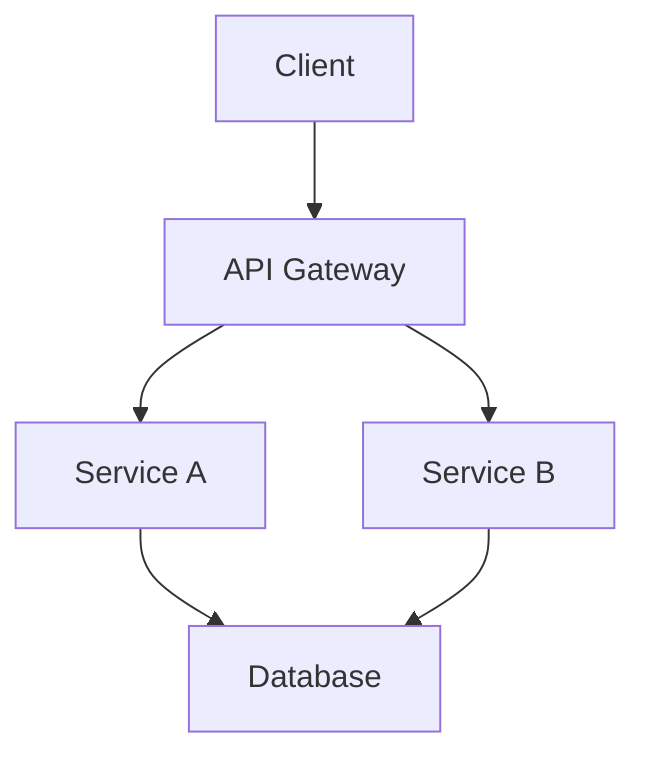
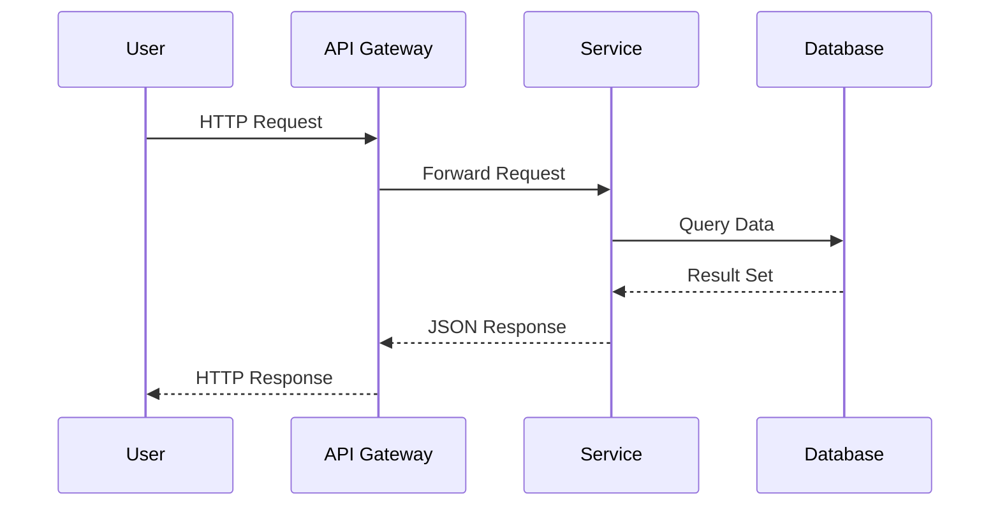

## Architecture Overview

Note: Mermaid diagrams are rendered automatically by the mermaid plugin. No extra configuration needed.

---

## Request Flow

Note: Sequence diagrams are useful for illustrating communication between components. The mermaid plugin handles rendering and sizing automatically.
